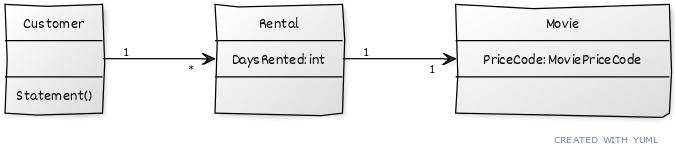

This repo intends to house a series of projects targeting writing tests for **Legacy Code**.  

The list of projects include:
- MovieRental.Domain
- MovieRental.Domain.Test

## Description of MovieRental.Domain Project

It is a program to calculate and print a statement of a customer's charges at a video store.

##### Inputs:
- which movies a customer rented
- for how long

##### Outputs:
- calculates the charges, which depend on: 
   - how long the movie is rented
   - type of the movie  
      - regular
      - children's
      - new releases
- computes frequent renter points, which vary depending on:
   - whether the film is a new release.
   
We inherited this code and now we try to extend it with new functionalities.

In order to contribute, your commits must conform to <u>**Tim Pope**</u>'s article on 
Git's commit message conventions known as 
"<a href="https://tbaggery.com/2008/04/19/a-note-about-git-commit-messages.html" target="_blank">*A Note About Git Commit Messages*</a>"